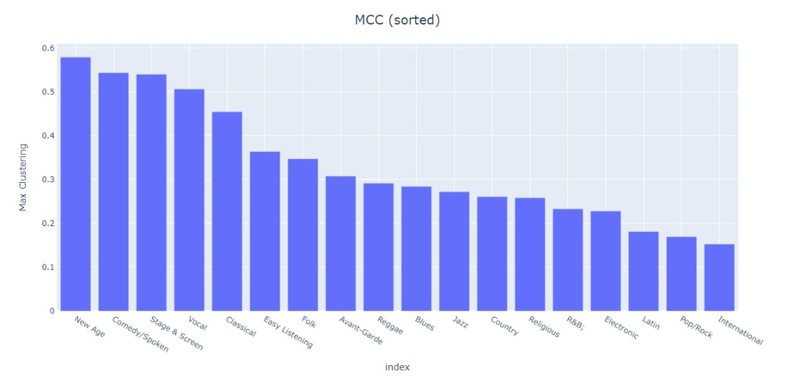
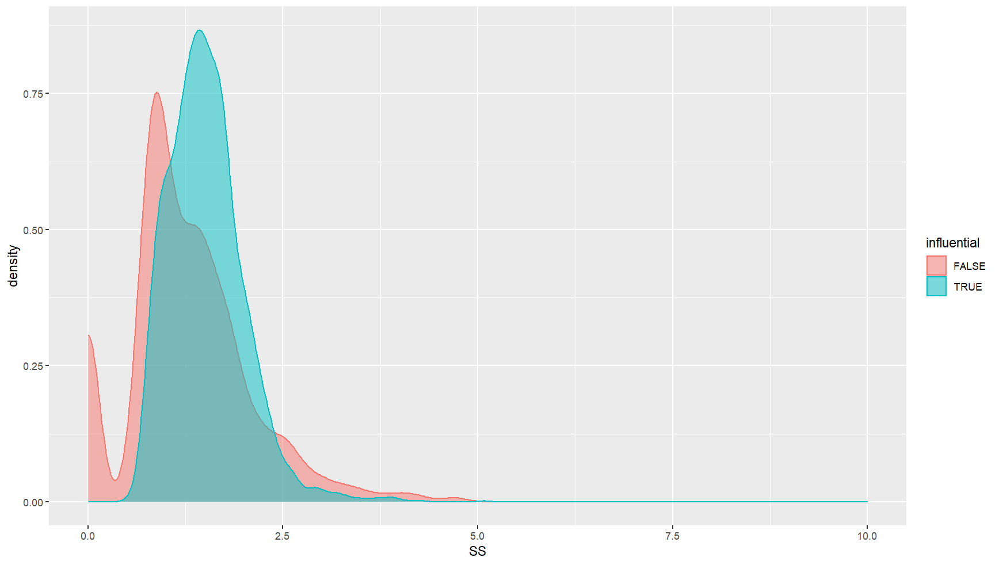

# README

## Project: The influence of music

#### Project Member: Kaiyang Chen, Baole Fang, Yumeng Bai


## Filetree

```
.
├── 2021_ICM_Problem_D_Data
│   ├── data_by_artist.csv
│   ├── data_by_year.csv
│   ├── full_music_data.csv
│   └── influence_data.csv
├── 2021_ICM_Problem_D_Data_std
│   ├── data_by_artist.csv
│   ├── data_by_year.csv
│   ├── full_music_data.csv
│   └── influence_data.csv
├── README.md
├── STAT4060J_Group25_Project_Final_Draft.pdf
├── step1
│   ├── influence_page_rank.py
│   ├── out_degree
│   │   ├── out_degree_0.1_0.png
│   │   ├── out_degree_0.2_0.png
│   │   ├── out_degree_0.3_0.png
│   │   ├── out_degree_0.4_0.png
│   │   ├── out_degree_0.5_0.png
│   │   ├── out_degree_0.6_0.png
│   │   ├── out_degree_0.7_0.png
│   │   ├── out_degree_0.8_0.png
│   │   └── out_degree_0.9_0.png
│   ├── page_rank_result
│   │   ├── influence_page_rank_0.05_0.csv
│   │   ├── influence_page_rank_0.1_0.csv
│   │   ├── influence_page_rank_0.2_0.csv
│   │   ├── influence_page_rank_0.3_0.csv
│   │   ├── influence_page_rank_0.4_0.csv
│   │   ├── influence_page_rank_0.5_0.csv
│   │   ├── influence_page_rank_0.6_0.csv
│   │   ├── influence_page_rank_0.7_0.csv
│   │   ├── influence_page_rank_0.8_0.csv
│   │   └── influence_page_rank_0.9_0.csv
│   ├── permutation_test_ranking.R
│   ├── sub_good.png
│   ├── subsub.png
│   └── visual.py
├── step2
│   ├── FeatureAnalysis.R
│   └── PvaluePlot.py
├── step3
│   ├── MCC.py
│   ├── original
│   │   ├── MCC.jpeg
│   │   ├── MCC_PermutationTest.jpeg
│   │   ├── artists.csv
│   │   ├── clusters.csv
│   │   └── mcc_null.csv
│   ├── similarity.py
│   ├── std
│   │   ├── MCC.jpeg
│   │   ├── MCC_PermutationTest.jpeg
│   │   ├── artists.csv
│   │   ├── clusters.csv
│   │   └── mcc_null.csv
│   └── visual.py
└── step4
    ├── SS.csv
    ├── SS.png
    ├── SS.py
    ├── SS_.csv
    ├── bootstrap.R
    └── influence_page_rank_0.5_0.csv
```
## Step1

Use influence_page_rank.py to implement PageRank algorithm and plot relevant figures. 

Then use permutation_test_ranking.R to do permutation tests on the two rankings.

Visual.py is used to generate influencial network plots.


## Step2

Use `python PvaluePlot.py` to generate the 2-tail p-value matrix for feature pairs.

Run the code trunk in FeatureAnalysis.R step by step to get the analysis result.

## Step 3: Measure of musical similarity

### Overview

In this step, we purpose a measure of musical similarity. We perform a permutation test to verify its validness. The null hypothesis is that the music genres are independent of musical features.

One assumption we make is that songs/musicians within the same genre are more similar than those between different genres. If we can reject the null hypothesis, it means that our measure of musical similarity is valid.

### Data

- [data_by_artist.csv](2021_ICM_Problem_D_Data_std/data_by_artist.csv)
- [influence_data.csv](2021_ICM_Problem_D_Data_std/influence_data.csv)

### How to run

1. Run [MCC.py](step3/MCC.py) and get [artists.csv](step3/std/artists.csv), [clusters.csv](step3/std/clusters.csv)

To run scripts successfully:
- Please specify the path of input and output
- Please install the necessary packages by yourself

### Results




## Step 4: Influence and similarity

### Overview

In this step, we analyze the relationship between musical influence and similarity. We perform a stratified bootstrap to find the confidence interval of the difference of SS mean. If the confidence interval lies above 0, it means that high-influential musicians have a stronger impact on their followers.

### Data

- [influence_page_rank_0.5_0.csv](step4/influence_page_rank_0.5_0.csv)

### How to run

1. Run [SS.py](step4/SS.py) and get [SS.csv](step4/SS.csv)
2. Replace "0.0" in [SS.csv](step4/SS.csv) with "nan" (data cleaning)
3. Run [bootstrap.R](step4/bootstrap.R) to compute the confidence interval

To run scripts successfully:
- Please specify the path of input and output
- Please install the necessary packages by yourself

### Results


