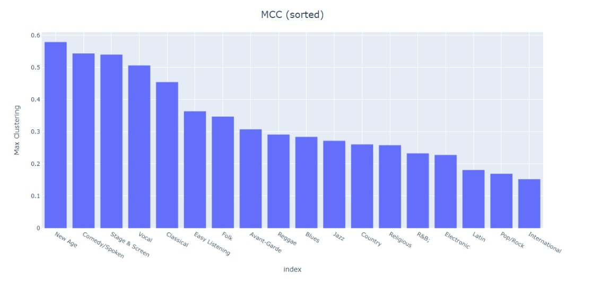
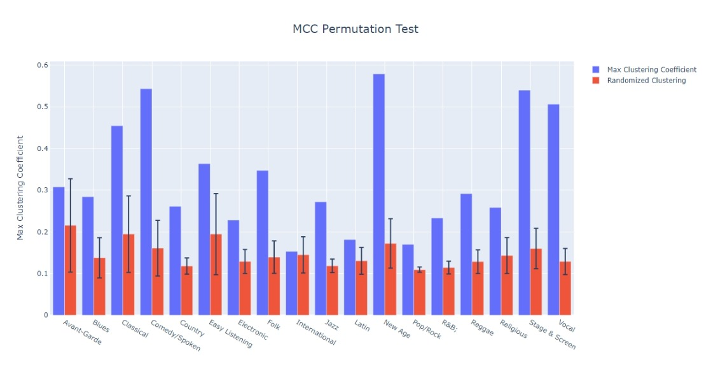

# Step 3: Measure of musical similarity

## Overview

In this step, we purpose a measure of musical similarity. We perform a permutation test to verify its validness. The null hypothesis is that the music genres are independent of musical features.

One assumption we make is that songs/musicians within the same genre are more similar than those between different genres. If we can reject the null hypothesis, it means that our measure of musical similarity is valid.

## Data

- [data_by_artist.csv](../2021_ICM_Problem_D_Data_std/data_by_artist.csv)
- [influence_data.csv](../2021_ICM_Problem_D_Data_std/influence_data.csv)

## How to run

1. Run [MCC.py](MCC.py) and get [artists.csv](std/artists.csv), [clusters.csv](std/clusters.csv), [MCC_null.csv](std/MCC_null.csv)

To run scripts successfully:
- Please specify the path of input and output
- Please install the necessary packages by yourself

## Results

