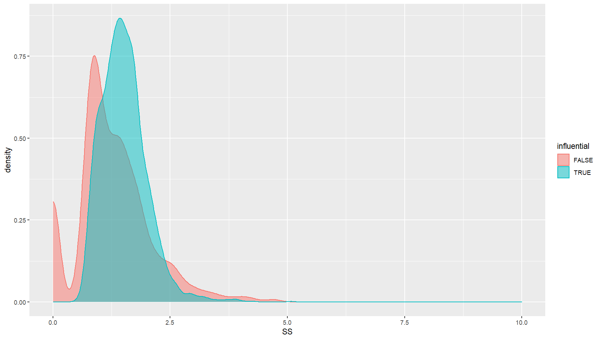

# Step 4: Influence and similarity

## Overview

In this step, we analyze the relationship between musical influence and similarity. We perform a stratified bootstrap to find the confidence interval of the difference of SS mean. If the confidence interval lies above 0, it means that high-influential musicians have a stronger impact on their followers.

## Data

- [influence_page_rank_0.5_0.csv](influence_page_rank_0.5_0.csv)

## How to run

1. Run [SS.py](SS.py) and get [SS.csv](SS.csv)
2. Replace "0.0" in [SS.csv](SS.csv) with "nan" (data cleaning)
3. Run [bootstrap.R](bootstrap.R) to compute the confidence interval

To run scripts successfully:
- Please specify the path of input and output
- Please install the necessary packages by yourself

## Results

